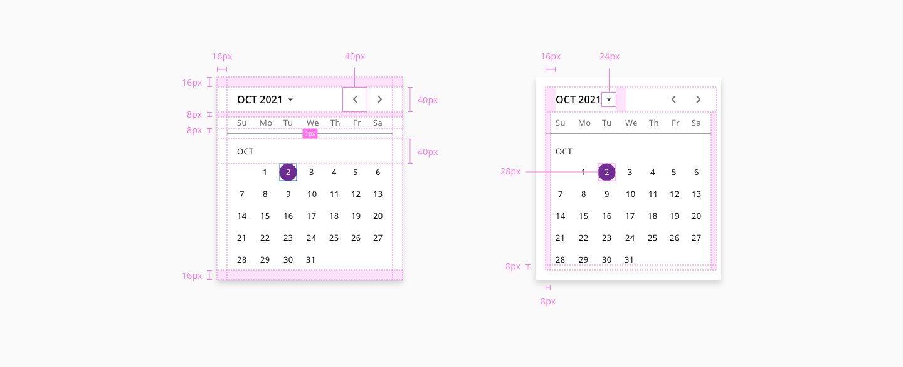

# Image usage

Images are used all across the design system documentation:

* [Creating and exporting images](#creating-and-exporting-images)
     * [Sizes](#sizes)
     * [Background](#background)
     * [Alignment and padding](#alignment-and-padding)
     * [File type](#file-type)
     * [Naming](#naming)
* [Specification images](#specification-images)
     * [Lines and measurements](#lines-and-measurements)
     * [Specification item specs](#specification-item-specs)
* [Include images in the documentation markdown](#include-images-in-the-documentation-markdown)
     * [Image URL](#image-url)
     * [Alternative text](#alternative-text)

## Creating and exporting images

When creating image content for the Halstack documentation stick to the following:

### Sizes

All images present in the documentation have a predefined size depending on the content and purpose.

| Width (px)    | Item         | Purpose                                                       |
| ------------- | ------------ |-----------------------------------------------------------    |
| 272           | `miniature`  | component miniature<sup>(*)</sup>                             |
| 960           | `half`       | Half width image, small components and cropped images         |
| 1440          | `medium`     | Medium width image, standard components                       |
| 1920          | `large`      | Large width image, large components or big number of items    |

(*)`miniature` image size is always 272x150px

### Background

| value         | Item                       |
| ------------- | -------------------------- |
| transparent   | `miniature`                | 
| #FAFAFA       | `half`, `medium`, `large`  | 

### Alignment and padding

The `half`, `medium` and `large` images meant for documentation pages should follow the same principles:

* Be **center aligned**
* Have **80px fom the top border** of the background container
* Leave **96px to the bottom border** of the container
* **Don't apply any border radius** to the image container

### File type

Images can be exported in `PNG`, `SVG` formats:

#### PNG

* PNG is preferred for raster-graphics (to show component examples).
* They are a lossless image format, which means when they are compressed, they don’t lose any data. They also allow for alpha transparency.

:heavy_exclamation_mark: **Note**: Text inside of a png is not accessible and therefore a PNG should never contain important information that cannot be accessed elsewhere on the page.

#### SVG

* SVG (Scalable Vector Graphic) is preferred for vector-graphics.
* Use an SVG file format when you have a flat, relatively simple asset such as logos, icons or basic shapes. Accessible text inside SVGs is possible but long strands of copy should be avoided.

#### Exporting images from the design software

Some of the most popular design softwares image exporting guidelines:

* [Adobe XD](https://helpx.adobe.com/xd/help/export-design-assets.html)
* [Sketch](https://www.sketch.com/docs/importing-and-exporting/)
* [Figma](https://help.figma.com/hc/en-us/articles/360040028114-Guide-to-exports-in-Figma)

### Naming

In order to improve the consistency and the readability across the multiple files follow always the same naming convention.

#### Component images

For images updated or added to an existing/new component:

```
component_name.png 
```


_Example of the images folder of the select component_

When needed, multiple words can be used in order to make the file name understandable:

```
component_name_other.png 
```

#### Principles

For images updated or added to an existing/new principle:

```
principle_name.png 
```

#### Miniatures

For miniature images:

```
miniature.png 
```


## Specification images

Technical images for design specifications follow the same general rules than the other image content in the documentation.



_Example of the date component specification image_

### Lines and measurements


_Specification items example_

#### Paddings and margins

* Use dotted lines and overlays to represent all the external and internal spacing units
* Avoid mixing the direction of the overlays in the same element (if overlays are place horizontally, don't mix with vertical)
* Try to place always the measurements outside the component, 8px from the border
* Place the measure text 8px from the measurement line

#### Border

* For `border-radius` use a squad 8px form the border of the element, and place the measurement text aligned with the rest of the component measurements
* For `border-width` use a 24x16px block placed always centered with the line stroke

#### Item sizes

* For items `width` and `height` properties, a sized squeare should be use drowing a direct line to the measure
* Measures using sized squares should be always aligned with the resto of the specs items

### Specification item specs

#### Color

| Property            | Element         | Value       |
| ---------------     | ----------      | ----------  |
| `color`             | Line            | #FF74E8     |
| `background color`  | Overlay         | #FF74E880   |


## Include images in the documentation markdown

### Image URL

Link the images to the page images folder:

```

```

### Alternative text

Always provide an alternative text in the images for accessibility purposes:

```

```

Add also a caption below the image matching the `Alt text` used:

```


_caption matching the alt text goes here_
```


