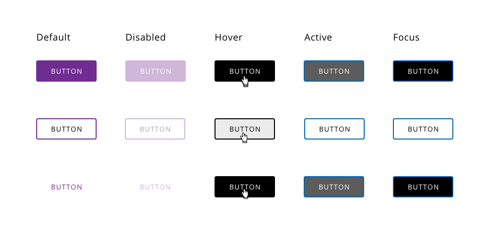

## Overview

Buttons are basic interface elements that initialize an action or function when the user interacts with them. The appearance of the button should suggest the user takes an action that leads to different scenarios.

These elements that reinforce to the user the necessity to interact are called CTA (Call to Action) components, which basically are designed to capture user attention and improve the user experience within the application.

## Appereance

Into DXC Design System you will find several buttons with different shades, colors, and sizes, each of them carefully designed following best practices to fit in every application that will be built or integrated with this system.

The examples below are using and applying the DXC Technology theme by default.

### Modes

We can identify three different modes that imply some visual changes according to color, border or opacity attributes.
Modes: **primary**, **secondary**, **text button**.

For taking into consideration, the main background colors for the application would be white or black, so the use of any button with such colors is a great option. In case that the user wants to customize color or contrast, it is recommended follow best practices and check the accessibility in any case.

### States

The states are the different behaviors of the button component based on the interaction of the user.
For the desktop version, we contemplate five different states by which can pass.

States: **default**, **disabled**, **hover**, **active** and **focus**.

## Design tokens

For every component, the design system offers a series of properties to customize the look and feel of the component and adapt it to the company branding or to an specific style guide.

These are the tokens that are defined for the component:

#### Primary button

| Tokens                         | Default value |
| ------------------------------ | ------------: |
| primaryBackgroundColor         |     `#6F2C91` |
| primaryFontColor               |     `#FFFFFF` |
| primaryHoverBackgroundColor    |     `#000000` |
| primaryHoverFontColor          |     `#FFFFFF` |
| primaryActiveBackgroundColor   |     `#676767` |
| disabledPrimaryBackgroundColor |     `#D0BDDB` |
| disabledPrimaryFontColor       |     `#FFFFFF` |
| focusColor                     |     `#005FCC` |

#### Secondary button

| Tokens                         | Default value |
| ------------------------------ | ------------: |
| secondaryOutlinedColor         |     `#6F2C91` |
| secondaryBackgroundColor       | `transparent` |
| secondaryFontColor             |     `#000000` |
| hoverOutlinedColor             |     `#000000` |
| secondaryHoverFontColor        |     `#000000` |
| secondaryHoverBackgroundColor  |     `#EEEEEE` |
| secondaryActiveBackgroundColor |     `#DBDBDB` |
| disabledSecondaryOutlinedColor |     `#D0BDDB` |
| disabledSecondaryFontColor     |     `#B1B1B1` |
| focusColor                     |     `#005FCC` |

#### Text button

| Tokens                    | Default value |
| ------------------------- | ------------: |
| textBackgroundColor       | `transparent` |
| textFontColor             |     `#6F2C91` |
| textHoverBackgroundColor  |     `#000000` |
| textHoverFontColor        |     `#FFFFFF` |
| textActiveBackgroundColor |     `#676767` |
| disabledTextFontColor     |     `#D0BDDB` |
| focusColor                |     `#005FCC` |

## Design Specifications

To define the button design specifications, several properties were identified and assigned immutable values ​​that make the component recognizable along applications, independently of the customizable styles given.

With the default theme, the components will get _black_, _yellow_ and _white_ as main colors.
To keep the consistency through the design system, the font used is _Open Sans_, which includes all the font variations: Light _(200)_, Regular _(400)_, Semibold _(600)_, Bold _(700)_ and Extrabold _(800)_.

By default the button implements feedback to communicate to the final user what action is taking place according to the laws of good user experience.

| Property           |       Value |
| ------------------ | ----------: |
| Margin             |      `15px` |
| Padding right/left |      `30px` |
| Padding top/bottom |      `12px` |
| Border Radius      |       `4px` |
| Border thickness   |       `2px` |
| Min. height        |      `43px` |
| Min. width         |     `122px` |
| Max. width         |     `420px` |
| Font size          |      `14px` |
| Font weight        |   `Regular` |
| Capitalization     | `Uppercase` |

### Icon Usage

It is not limited the content of a button like so the user can place icons inside of a button to reinforce the action accordingly to the meaning.

Any icon can be used in the DXC Design System, so it is apt to the user to choose between one of the multiple options that are offered through internet but it is recommended to use the same library of icons along the application to keeping concistency.

Also, another point to consider is that the icon can go before or after the text with a separation of 10 pixels respecting the main button's text. To keeping the consistency, the icon sizes were defined based on the content and the implementation of the icons, resulting in the following:

\*Do not use icons mainly for visual interest, the glyph must add information and clarification to the action that would be performed in the context of the button.

A button with an icon and no text is also allowed in the design system.

## User Interface Design Considerations

Here, you can find more considerations in the using of buttons:

- In instances where buttons are vertically stacked, buttons should be the same length.
- Horizontally displayed buttons are dependent on the amount of text, so button lengths may vary, always considering the minimum and maximum established sizes.
- Text or images on a button should always be centered.
- There must be 24 pixels of space between horizontally displayed buttons.
- Upper case text should be used on all buttons.
- Button location, not dictated by workflow, should be centered or right aligned at the section/page margin. This can be defined by the application but should be consistent throughout.

## Links and references

- https://xd.adobe.com/view/23e2cca4-5021-490a-a548-e99a9b4a2006-76b1/screen/84bacd8b-f5aa-4369-9fe3-c2cd53165c90/variables/
