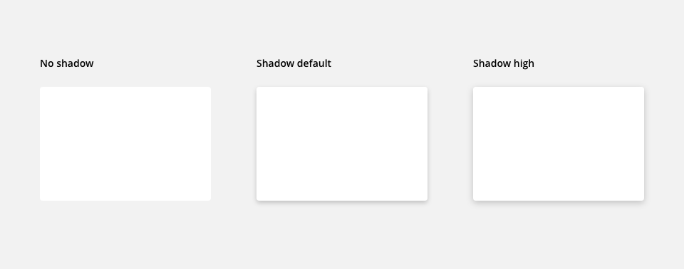
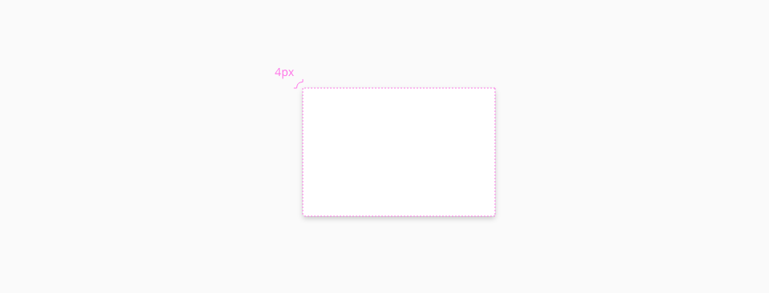

# Box

There are different ways to organise the content on the webpage to facilitate the user according to his nature of interaction with the content like forms, tables, lists etc. One of the best ways to organize the webpage is by using groups of related content, this can be achieved by using a dedicated Box component.


## Usage

* Organize the group layout with the information presented clearly by applying the styles in the box container.
* Box can be reused accros the UI, avoid using different variants in the same page.
* Use always a minimun padding and always leave enough margin when stacking boxes so the shadows don't ovelap.

## Variants



_Box component variants_

The `shadow-default` and `shadow-high` variants can be used to create clear distictions between sections of content without the use of borders or separators, the `no-shadow` helps in the process of building the layout. Note that when using an application `background-color` different than white, the limits of the box are goig to be clearly visible no matter the variant choosed.
## Content

Any type of content can be place inside the box component.


## Design specifications




_Component design specifications_
### Color

| Component token                 | Element                      | Core token             | Value                     |
| :------------------------------ | :--------------------------- | :--------------------- | :------------------------ | 
| `backgroundColor`               | Container                    | `color-white`          | #ffffff                   |
| `borderColor`                   | Container                    | `color-transparent`    | #transparent              |


### Border

| Component token                 | Element                      | Core token             | Value                     |
| :------------------------------ | :--------------------------- | :--------------------- | :------------------------ | 
| `borderThickness`               | Container border             | `border-width-0`       | 0                         |
| `borderRadius`                  | Container border             | `border-radius-medium` | 0.25rem / 4px             | 
| `borderStyle`                   | Container border             | `border-style-none`    | none                      | 


### Shadow

| Component token                 | Element                      | Core token             | Value                           |
| :------------------------------ | :--------------------------- | :--------------------- | :------------------------------ | 
| `noneShadowDepth`               | Container shadow             | `shadow-none`          | none                            |
| `oneShadowDepth`                | Container shadow             | `shadow-default`       | 0 4px 6px -1px rgba(0,0,0,0.1)  | 
| `twoShadowDepth`                | Container shadow             | `shadow-high`          | 0 8px 14px -2px rgba(0,0,0,0.1) | 


### Width

In the cases of `fillParent` and `fillContent` the box is going to behave as a fluid container occupying the space the parent leaves for its children or adapting its size to the children it the box has. Instead of using a fluid approach, you can set a fixed size, choosing between `small`, `medium` and `large` properties.

| Property | Value    |
| --       | --       |
| `small`  | 48px     |
| `medium` | 240px    |
| `large`  | 480px    |
| `fillParent`  |  -  |
| `fillContent` |  -  |

### Margin

margin | value
-- | --
```xxsmall``` | 6px
```xsmall``` | 16px
```small``` | 24px
```medium``` | 36px
```large``` | 48px
```xlarge``` | 64px
```xxlarge``` | 100px

And also apply different values to each side of the component:
```top``` ```bottom``` ```left``` ```right```

### Padding

padding | value
-- | --
```xxsmall``` | 6px
```xsmall``` | 16px
```small``` | 24px
```medium``` | 36px
```large``` | 48px
```xlarge``` | 64px
```xxlarge``` | 100px

And also apply different values to each side of the component:
```top``` ```bottom``` ```left``` ```right```

## Links and references

* [React component](https://developer.dxc.com/tools/react/next/#/components/box)
* [Angular component](https://developer.dxc.com/tools/angular/next/#/components/box)
* [Adobe XD component](https://xd.adobe.com/view/5dbf0c6e-c116-4fe2-970e-344911a74201-08ec/)

____________________________________________________________

[Edit this page on Github](https://github.com/dxc-technology/halstack-style-guide/blob/master/guidelines/components/box/README.md)
