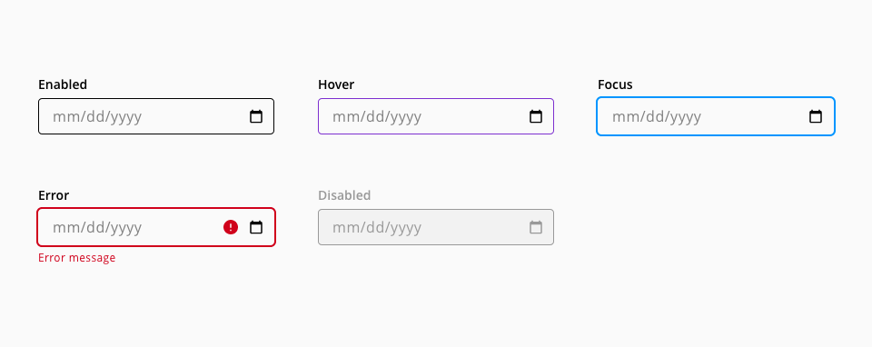
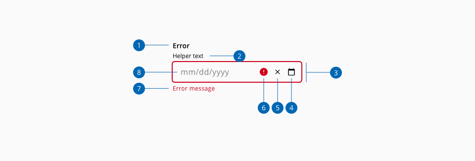
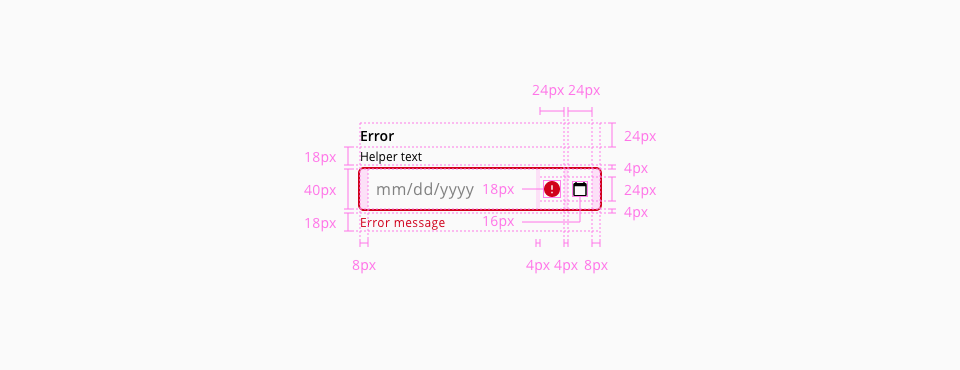

# Date input

A date input is a user interface element where the user can type or select a date in a predefined format. 

## Usage

* Use the date input component when asking for a past, present, or future date
* Provide a hint with the date format expected in the placeholder
* Use a concise label to indicate what the date selection refers to

## States

### date input

States: **enabled**, **hover**, **focus**, **error**, and **disabled**.

_Examples of date input states_

### Date dialog

States: **enabled**, **hover**, **focus**, and **selected**.

_Examples of the calendar dialog states_

## Anatomy

1. Label
2. Helper text _(Optional)_
3. Input container
4. Date button
5. Clear action
6. Error indicator
7. Error message
8. Placeholder / value

## Internationalization

The date format depends on an ISO definition for each country and the preference of use within the application.

The format of the date may vary depending on language, region, country or customer. It is a good practice to give to the user some type of hint about the date format and in many cases.

* The default format for the United States is `mm/dd/yyyy`
* The default format for Australia, Europe, Africa, South America most countries of Asia is `dd/mm/yyyy`
* The default format in China is `yyyy/mm/dd`

## Design Specifications

### date input

_date input design specifications_

The date input `color`, `typography`, `border`, `spacing`, `width` and `margin` specifications are inherited from the text-input, for reference [check the text-input component documentation](https://developer.dxc.com/design/guidelines/components/text-input). 

The date input doesn't have the following text-input elements, therefore, their listed styles don't apply:

* Prefix / Suffix

### Datepicker dialog

_Structure and spacing for date picker calendar pop-up_

#### Color

| Component token                        | Element                        | Core token                   | Value         |
| :------------------------------------- | :----------------------------- | :--------------------------- | :------------ |
| `pickerBackgroundColor`                | Dialog container               | `color-white`                | #ffffff       | 
| `pickerDayFontColor`                   | Dialog text                    | `color-black`                | #000000       | 
| `pickerCurrentDateColor`               | Dialog title                   | `color-grey-500`             | #999999       | 
| `pickerHoverDateBackgroundColor`       | Container background           | `color-purple-200`           | #e5d5f6       | 
| `pickerSelectedDateColor`              | Date text:selected             | `color-white`                | #ffffff       | 
| `pickerSelectedDateBackgroundColor`    | Date background:hover          | `color-purple-700`           | #5f249f       | 
| `pickerHoverDateFontColor`             | Date text:hover                | `color-black`                | #000000       | 
| `pickerYearFontColor`                  | Year label                     | `color-black`                | #000000       | 
| `pickerMonthFontColor`                 | Mont label                     | `color-black`                | #000000       | 
| `pickerWeekFontColor`                  | Weekday label                  | `color-black`                | #000000       | 
| `pickerMonthArrowsBackgroundColor`     | Month selection controls       | `color-transparent`          | transparent   |  
| `pickerFocusColor`                     | Focus indicator                | `color-blue-600`             | #0095ff       | 

#### Typography

| Component token           | Element                        | Core token                   | Value                   |
| :------------------------ | :----------------------------- | :--------------------------- | :---------------------- |
| `pickerFontFamily`        | Datepicker dialog              | font-family-sans`            | 'Open Sans', sans-serif |

| Property                      | Element          | Core token              | Value        |
| :---------------------------- | :--------------- | :---------------------- | :----------- |
| `font-size`                   |  Year selector   | `font-scale-03`         | 1rem / 16px  |
| `font-size`                   |  Current month   | -                       | 13px         |
| `font-size`                   |  Day             | -                       | 13px         |
| `font-weight`                 |  Year selector   | `font-weight-semibold`  | 600          |
| `font-weight`                 |  Current month   | `font-weight-regular`   | 400          |
| `font-weight`                 |  Day             | `font-weight-regular`   | 400          |

#### Spacing

| Property                      | Element               | Core token      | Value            |
| :---------------------------- | :-------------------- | :-------------- | :--------------- |
| `padding`                     |  Calendar container   | `spacing-05`    | 1rem / 16px      |
| `padding-left/right`          |  Month container      | `spacing-03`    | 0.5rem / 8px     |
| `padding-left/right`          |  Year selector        | `spacing-05`    | 1rem / 16px      |
| `padding-top/bottom`          |  Separator            | `spacing-03`    | 0.5rem / 8px     |

#### Sizing

| Property                      | Element                |  Value      |
| ----------------------------- | ----------------       | ----------- |
| `height/width`                |  Selected date circle  |   28/28px   |
| `height/width`                |  Year selection caret  |   24/24px   |
| `height/width`                |  Calendar top controls |   24/24px   |

## Accessibility

### WCAG 2.2

* Understanding WCAG 2.2 - [SC 2.1.1: Keyboard](https://www.w3.org/WAI/WCAG22/Understanding/keyboard)
* Understanding WCAG 2.2 - [SC 2.1.2: No keyboard trap](https://www.w3.org/WAI/WCAG22/Understanding/no-keyboard-trap)
* Understanding WCAG 2.2 - [SC 2.4.6: Headings and labels](https://www.w3.org/WAI/WCAG22/Understanding/headings-and-labels)
* Understanding WCAG 2.2 - [SC 2.4.7: Focus Visible](https://www.w3.org/WAI/WCAG22/Understanding/focus-visible)

### WAI-ARIA 1.2

* WAI-ARIA authoring practices 1.2 - [3.9 Dialog modal](https://www.w3.org/TR/wai-aria-practices-1.2/#dialog_modal)
* WAI-ARIA authoring practices 1.2 - [Date picker design pattern](https://www.w3.org/TR/wai-aria-practices/examples/dialog-modal/datepicker-dialog.html)

## Links and references

* [React component](https://developer.dxc.com/tools/react/next/#/components/dateInput)
* [Angular component](https://developer.dxc.com/tools/angular/next/#/components/dateInput)
* [Adobe XD component](https://xd.adobe.com/view/8da8ab12-b0a1-469d-a72f-9d2588c8dbf2-d8fb/)

____________________________________________________________

[Edit this page on Github](https://github.com/dxc-technology/halstack-style-guide/blob/master/guidelines/components/date input/README.md)
