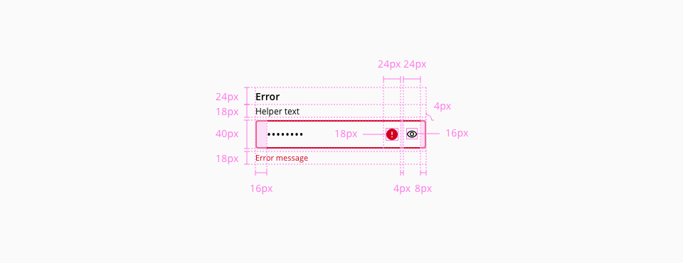

# Input-password

The input-password component is very much like the input-text, with the difference that their value is obscured by default(by replacing its characters with dot symbol ("•") and the mask can be toogled on/off using the show and hide component action.

## Usage

### Do

* Use the component input-password when the value expected is a password and need to be secured
* Provide the requirements in the helper text

### Don't

* Show the validation of the input-password until the component loses the focus
* Disable the copy/paste input functionality

## States

The component password has the following states:

States: **Enabled**, **Hover**, **Focus**, **Error** and **Disabled**.

_Input-password component states_

## Anatomy

_Component anatomy example_

1. Label
2. Helper text _(Optional)_
3. Input container
4. Show/Hide action
5. Clear action
6. Error icon
7. Error message
8. Input value

## Actions

_Show and hide action to toggle the value visibility_

The value of the input can be toggled on or off using the default action the component provides. The input-password can be also clearable.

## Design specifications

_Input-password component specifications_

The input-password `color`, `typography`, `border`, `spacing`, `width` and `margin` specifications are inherited from the input-text, for reference [check the input-text component documentation](). 

The input-password doesn't have the following text-input elements, therefore, their listed styles don't apply:

* Placeholder
* Prefix / Suffix

## Accesibility

### WCAG 

* Understanding WCAG 2.2 - [SC 1.3.5 Identify Input Purpose](https://www.w3.org/WAI/WCAG22/Understanding/identify-input-purpose.html)
* Understanding WCAG 2.2 - [SC 3.3.3 Error Suggestion](https://www.w3.org/WAI/WCAG22/Understanding/error-suggestion)
* Understanding WCAG 2.2 - [SC 3.3.7 Accessible Authentication](https://www.w3.org/WAI/WCAG22/Understanding/accessible-authentication)

### WAI Web Accessibility Tutorials

* Forms - [Full Password Example](https://www.w3.org/WAI/tutorials/forms/examples/password/)

## Links and references

* [React component](https://developer.dxc.com/tools/react/next/#/components/passwordInput)
* [Angular component](https://developer.dxc.com/tools/angular/next/#/components/passwordInput)
* [Adobe XD component](https://xd.adobe.com/view/9e81c000-7d20-4531-a6cd-8da5f4de876e-cbd2/)

____________________________________________________________

* [Edit this page on GitHub](https://github.com/dxc-technology/halstack-style-guide/blob/master/guidelines/components/password-input/README.md)

