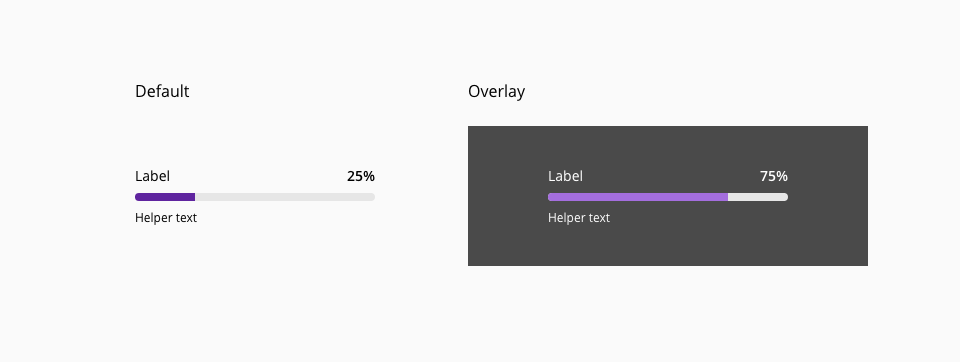
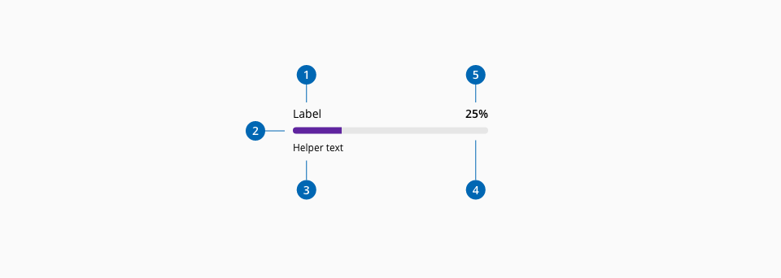

# Progress-bar

Progress indicators offer visibility of system status to the user, giving feedback to indicate that the application is taking some time to processing data. The main aim of these components is to reduce the user's uncertainty about offering something to look at while the user is waiting for the end.

A progress bar should be used in any scenario that will take more than 1 second in performing the action, for anything that takes less than that time, it will be distracting for the user.

## Usage

### Do

* Use a progress bar when it will give people feedback in a long-running process with continuous values.
* Add additional information to clarify to the user the action for which is waiting ("Sending documents...")
* Use the determinate type if it is possible, the user can have an estimation on how long it is gonna take.

### Don't

* For an unknown amount of time/progress, consider using a loading spinner instead.
* Do not use this type of component in actions that will take less than 1 minute to the system.

## Variants

The component progress-bar has two variants: **default** and **overlay**.

## Anatomy

1. Label _(Optional)_
2. Progress track line
3. Helper text _(Optional)_
4. Progress total line
5. Progress indicator _(Optional)_

## Determinate or indeterminate   
 

_Determinate progress bar_

* Determinate indicators display how long a process will take. They should be used in longer processes.

_Indeterminate progress bar_

* Indeterminate indicators express an unspecified amount of wait time. They should be used when:
        * The processing time is unknown.
        * The wait time is expected to be short enough that it’s not necessary to display.   

## Design Specifications

_Component design specifications_

### Color

| Tokens         | value         |
| ------------   | ------------: |
| `trackLine`    |     #5F249F   |
| `totalLine`    |     #E6E6E6   |
| `fontColor`    |     inherit   |
| `overlayColor` |     #000000   |

### Size

| width                 |   Value |
| --------------------- | ------: |
| Min. width            | `100px` |
| Max. width            |   `80%` |
| Height                |   `8px` |
| Spacing text with bar |  `12px` |
| Font size             |  `14px` |

Overlay

| Property    |   Value |
| ----------- | ------: |
| Max. Width  | `100vw` |
| Max. Height | `100vh` |

## Links and references

* [Angular CDK component](https://developer.dxc.com/tools/angular/next/#/components/progressbar)
* [React CDK component](https://developer.dxc.com/tools/react/next/#/components/progressBar)

____________________________________________________________

[Edit this page on Github](https://github.com/dxc-technology/halstack-style-guide/blob/master/guidelines/components/progressbar/README.md)
