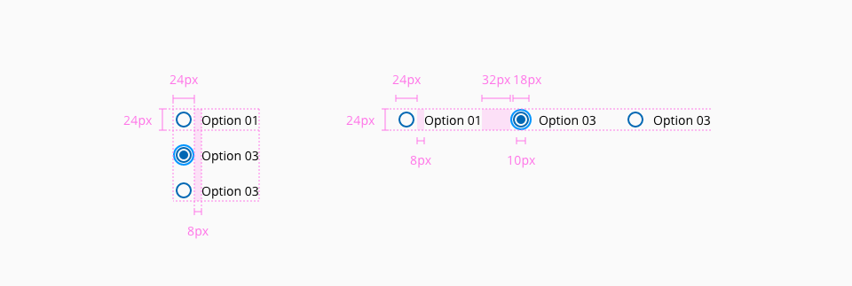

# Radio-buttons

Radio buttons are elements that let the user select one option within a options group. It is the correct election when it has a list with six elements or fewer items, when the user needs to pick one mutually exclusive choice from the list.
Clicking a non-selected radio button will deselect whatever other button was previously selected in the list.

* Use radio buttons only for settings, in a logical order based on some criteria and not avoid the alphabetical sorting.
* Labelling should be concise and clearly differentiated with respect to other options.
* By default, one option of the radio group must be pre-selected. Select the safest or convinient option.


## Modes

Selected mode must be used when the user select an option or by default the value of the radio button is selected. For the rest of the cases, the mode that the component should get is unselected.

Modes: **selected** or **unselected**.


## States

The following states are defined in the life cycle of the component: **enabled**, **focus** and **disabled**.


## Design Specifications

Radio button specifications are similar to the checkbox component since the usage of both are quite alike.
The outlined shape has 20 by 20 pixels. In case the radio is selected, the inner shape has a size of 10 by 10 pixels.



### Color

| Tokens            | Default value |
| ----------------- | :-----------: |
| color             |   `#000000`   |
| disabledColor     |   `#B1B1B1`   |
| fontColor         |   `inherit`   |
| disabledFontColor |   `#B1B1B1`   |
| focusColor        |   `#005FCC`   |

\*There is a relation between the _backgroundColor_ of the component and the _borderColor_ in the case that the radio is unselected. The color will be the same for both scenarios.

### Size 

| Property              | Element       | Value     |  
| --------------------- | -----------   | --------  | 
| `width`               | radio         | 20px      | 
| `width`               | focus outline | 26px      | 
| `height`              | radio         | 20px      | 
| `height`              | focus outline | 26px      |  

### Margin

Margin can be set independently for `top`, `right`, `bottom`, `left`.

margin | value
-- | --
```xxsmall``` | 6px
```xsmall``` | 16px
```small``` | 24px
```medium``` | 36px
```large``` | 48px
```xlarge``` | 64px
```xxlarge``` | 100px

### Typography

| Property              | Element       | Value     |   Token          |
| --------------------- | -----------   | --------  | ---------        |
| `font-size`           | label         | 16px      | `type-scale-03`  |
| `font-weight`         | label         | 400       | `type-regular`   |

### Border

| Property              | Element       | Value     |   Token          |
| --------------------- | -----------   | --------  | ---------        |
| `border-width`        | radio         | 2px       | -                |
| `border-width`        | focus outline | 2px       | -                |


## Stack

Radio buttons may be displayed vertically or horizontally stacked.


### Vertical stacking

Short lists of radio buttons should be stacked vertically below a descriptive label to better associate the group. Options that are listed vertically are easier to read.
With this option, try to make one choice per line. Also, avoid nesting whenever is possible, all options should be keep at same level to not generate confusion.


### Horizontal stacking

Multiple radio buttons may be displayed horizontally across the page while keeping them aligned within their respective columns. Here, it is needed to have in consideration that the linear radio buttons represent some challenge, because it's difficult to scan and localize, sometime a vertical position could be better.

In any case, in the specification it is specified the ideal distance between component with label in the same horizontal edge to avoid the problem of pairing and scannability.

## Accessibility

### WCAG 2.2

**Understanding WCAG 2.2** - [SC 1.3.1: Info and Relationships](https://www.w3.org/WAI/WCAG22/Understanding/info-and-relationships.html)

* Information, structure, and relationships conveyed through presentation can be programmatically determined or are available in text.

**Understanding WCAG 2.2** - [SC 3.3.2: Labels or Instructions](https://www.w3.org/WAI/WCAG22/Understanding/labels-or-instructions.html)

* Labels or instructions are provided when content requires user input.

**Understanding WCAG 2.2** - [SC 2.4.6: Headings and Labels](https://www.w3.org/WAI/WCAG22/Understanding/headings-and-labels.html)

* Headings and labels describe topic or purpose.

### WAI-ARIA 1.2

**WAI-ARIA Authoring Practices 1.2** - [3.12 Radio group](https://www.w3.org/TR/wai-aria-practices-1.2/#radiobutton)

**[Keyboard interaction](https://www.w3.org/TR/wai-aria-practices-1.2/#keyboard-interaction-15)**
* The radio buttons are contained in or owned by an element with role radiogroup.
* Each radio button element has role radio.
* If a radio button is checked, the radio element has `aria-checked` set to true. If it is not checked, it has `aria-checked` set to false.
* Each radio element is labelled by its content, has a visible label referenced by `aria-labelledby`, or has a label specified with `aria-label`.
* The radiogroup element has a visible label referenced by `aria-labelledby` or has a label specified with `aria-label`.
* If elements providing additional information about either the radio group or each radio button are present, those elements are referenced by the radiogroup element or radio elements with the `aria-describedby` property.


## User Interface Design Considerations

- Unless a selection is mandatory, a user should be able to re-click a radio button to deselect.
- Single radio buttons should not be used.
- Use radio buttons on wizard pages to make alternatives clear to the user.
- If the question that the user needs to responde is as easier as yes/no, it is recommended to use checkbox instead of radio button.

## Links and references

- https://xd.adobe.com/view/23e2cca4-5021-490a-a548-e99a9b4a2006-76b1/screen/578ce690-701e-4daa-869d-70b55ea4f68e/variables/

[Edit this page on Github](https://github.com/dxc-technology/halstack-style-guide/blob/master/guidelines/components/radio/README.md)
