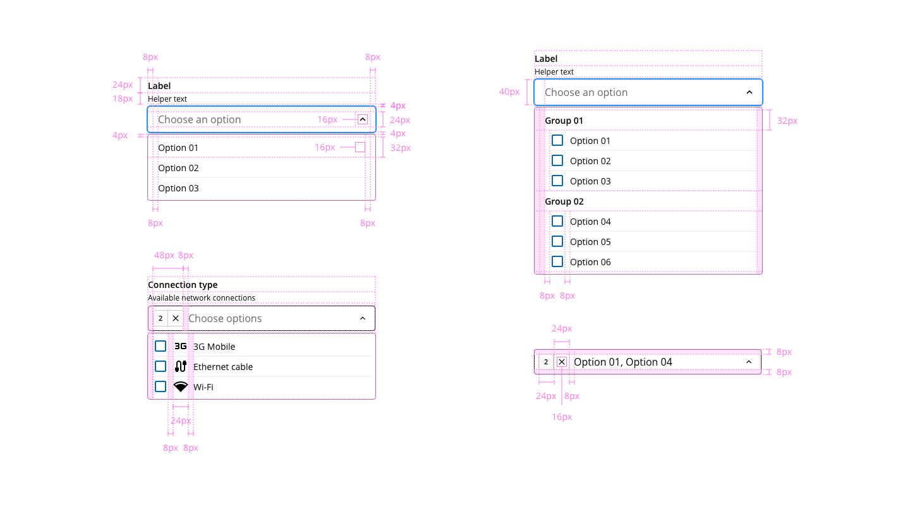

# Select

A select component is a right choice to preventing errors with predefined options, also they reduce the vertical space by showing several options in a reduced space. Selects are used in forms, letting the user select an option instead using an input.

## Usage


### Single select

- A dropdown element should allow the user to select one option from a list.
- The select component should always display a label, different from any name in the option list.
- If the options list is extensive, consider letting the user type for suggestions filtering the whole number of options.
- A default choice can be displayed as the placeholder before user selection. It must be placed as the first item on the options list and appear selected.
- Use progressive disclosure between linked select components.

### Multi-select

- If more than one option is applicable, a multi-selection box should be used.
- If the list of options is short (4 or less) and users can select more than one option, consider using checkboxes instead of a multi-selection list for simplicity and visual clarity.
- Multi-select fields include checkboxes for every single option in the list, the entire row must be clickable.


## States

### Select input

States are defined for select component based on the interactions that the user can reproduce. The states are: **enabled**, **focus**, **error** and **disabled**:


### Options list

The options have two states: **enabled**, **hover**, **focus** and **selected**:


## Multiple selection

Allows the user to select more than one option from the list. To indicate which items are selected and which not, the design for multiple selections integrates a checkbox pairing with each option from the dropdown.


## Required and error

* A required empty select should show an error message when submitted.
* Helper text can be added to the component, [specs](https://developer.dxc.com/design/components/text-input) are available in the input component.


## Design Specifications



### General

#### Color

| Component token                   | Element                    | Core token         | Value      |             
| :-------------------------------- | :------------------------- | :----------------- | :--------- |
| `assistiveTextFontColor`          | Helper text                | `color-black`      | #000000    |
| `labelFontColor`                  | Label                      | `color-black`      | #000000    |
| `disabledColor`                   | All:disabled               | `color-black`      | #000000    |
| `errorColor`                      | Error message              | `color-red-700`    | #d0011b    |
| `optionBackgroundColor`           | Option list dialog         | `color-white`      | #ffffff    |
| `optionFontColor`                 | Option list item           | `color-black`      | #000000    |
| `scrollBarThumbColor`             | Scroll bar                 | `color-grey-700`   | #666666    |
| `scrollBarTrackColor`             | Scroll bar                 | `color-grey-500`   | #999999    |
| `optionIconColor`                 | Option list icon           | `color-black`      | #000000    |
| `hoverOptionBackgroundColor`      | Option list item:hover     | `color-grey-100`   | #f2f2f2    |
| `activeOptionBackgroundColor`     | Option list item:active    | `color-grey-200`   | #e6e6e6    |
| `selectedOptionBackgroundColor`   | Option list item:selected  | `color-grey-300`   | #cccccc    |
| `underlineColor`                  | Underline                  | `color-black`      | #000000    |
| `underlineFocusColor`             | underline:focus            | `color-black`      | #000000    |
| `valueFontColor`                  | Value                      | `color-black`      | #000000    |
| `valueIconColor`                  | Icon                       | `color-black`      | #000000    |
| `arrowColor`                      | Arrow                      | `color-black`      | #000000    |
| `focusColorOnDark`                | Focus indicator            | `color-blue-600`   | #0095ff    |


#### Size

The component `width` can adopt the following values:

width | value
-- | --
```small``` | 60px
```medium``` | 240px
```large``` | 480px
```fillParent``` | -

#### Margin

Select `margin` can use the values:

margin | value
-- | --
```xxsmall``` | 6px
```xsmall``` | 16px
```small``` | 24px
```medium``` | 36px
```large``` | 48px
```xlarge``` | 64px
```xxlarge``` | 100px

These values can be applied independently to each side of the component:
```top``` ```bottom``` ```left``` ```right```

### Select input

Select input specifications are the same as the [text-input](https://developer.dxc.com/design/components/text-input)

### Options list

#### Single select

| Property for single     |                           Value |
| ----------------------- | ------------------------------ |
| List item `padding-left`      |            16px |
| `height`                  |     36px |
| `font-size`               |                          16px |
| `font-weight`             |                       Regular |
| Icon size               |                    20 x 20px|
| Spacing between icon and label | 12px  |
| Focus outline `border-width` |  2px |


#### Multi-select

| Property for multiple   |                 Value |
| ----------------------- | -------------------- |
| List item `padding-left`      |            16px |
| `height`                  |     48px |
| `font-size`               |                          16px |
| `font-weight`             |                       Regular |
| Icon size               |                    20 x 20px|
| Spacing between checkbox and label | 12px  |
| Spacing between icon and label | 12px  |
| Focus outline `border-width` |  2px |


## Accessibility

### WCAG 2.2

* Understanding WCAG 2.2 - [SC 3.2.2: On Input](https://www.w3.org/WAI/WCAG22/Understanding/on-input.html)

### WAI-ARIA 2.1 

* WAI-ARIA practices 2.1 - [3.14 Listbox](https://www.w3.org/TR/wai-aria-practices-1.2/#Listbox)


## Links and references

* [React component](https://developer.dxc.com/tools/react/next/#/components/select)
* [Angular component](https://developer.dxc.com/tools/angular/next/#/components/select)
* [Adobe XD component](https://xd.adobe.com/view/af227d9a-92fa-4e32-b735-b1e914a9d447-fa71/)

____________________________________________________________

[Edit this page on Github](https://github.com/dxc-technology/halstack-style-guide/blob/master/guidelines/components/select/README.md)

