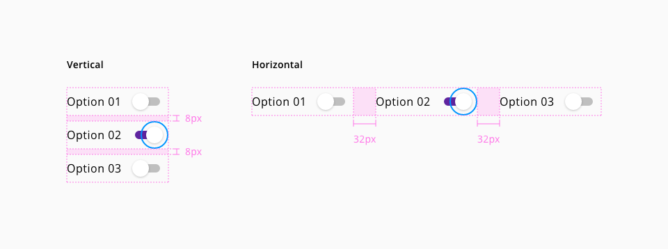

# Switch

Switch toggles are elements that can get two simple states, each of them has an impact on the system and it can be switched on or off, there are no more options.
If the switch toggle is on one state, the action to change it will modify to value of the element to the contrary.

## Usage

- Switch toggles should be used in place of radio buttons whenever the options are opposites of each other (i.e. yes/no, on/off, etc).
- Try to present your lists vertically, with one choice per line.
- Switches have immediate effect over the application, changing preferences and configuration settings. Don't use a submit button.

## States

Five different states are defined in the life cycle of the component: **unselected enabled**, **unselected focus**, **unselected disabled**, **selected enabled**, **selected focus** and **selected disabled**

_Switch component states_

## Anatomy

1. Label
2. Thumb
3. Track

### Stacking

In some application the use of several switches based on the requirements could appear, that why we provide some indications in the case that the user needs to use stacked switches.

### Label position

_Switch label position options example_

| Position         | Description                                               |
| :--------------- | :-------------------------------------------------------- |
| **Label before** | Labels before the switch indicate what the switch is for  |
| **Label after**  | Labels after the switch indicate the state of the switch  |

## Design Specifications

_Switch design specifications_

## Color

| Tokens                                | Default value |
| ------------------------------------- | ------------: |
| `checkedTrackBackgroundColor`           |     #5f249f |
| `disabledCheckedTrackBackgroundColor`   |     #D0BDDB |
| `checkedthumbBackgroundColor`           |     #FFFFFF |
| `uncheckedThumbBackgroundColor`         |     #FFFFFF |
| `uncheckedTrackBackgroundColor`         |     #D9D9D9 |
| `disabledUncheckedTrackBackgroundColor` |     #D9D9D9 + 0.12 opacity |
| `fontColor`                             |     #000000 |
| `disabledFontColor`                     |     #000000 + 0.12 opacity |
| `focusColor`                            |     #005FCC |

#### Sizes

| Property                   |         Value |
| -------------------------- | ------------: |
| Toggle bar                 |          36px |
| Focused ripple             |       42x42px |
| Toggle button              |       24x24px |

#### Margin

margin | value
-- | --
`xxsmall` | 6px
`xsmall` | 16px
`small` | 24px
`medium` default | 36px
`large` | 48px
`xlarge` | 64px
`xxlarge` | 100px

And also apply different values to each side of the component:
`top` `bottom` `left` `right`

#### Typography

| Property                   |         Value |
| -------------------------- | ------------: |
| Font size (with text)      |        `16px` |
| Font weight                |     `Regular` |

#### Spacing

| Property                   |         Value |
| -------------------------- | ------------: |
| Spacing between label and toggle |        `12px` |

## Links and references

- [React CDK component](https://developer.dxc.com/tools/react/next/#/components/switch)
- [Angular CDK component](https://developer.dxc.com/tools/angular/next/#/components/switch)

____________________________________________________________

[Edit this page on Github](https://github.com/dxc-technology/halstack-style-guide/blob/master/guidelines/components/switch/README.md)

