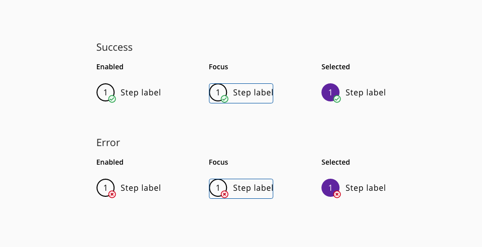

# Wizard

Wizard represents a stepped workflow as a form of linear and mandatory progression through a defined process with several bullet points where the user need to interact with the content of each step during the workflow.

### Usage

- The horizontal/vertical line should not extend to the left of the first circle or to the right of the last circle
- Do not overwhelmed the component with too many steps, it won't be a good idea for the user workflow neither for the display of the information

## Variants

The wizard component has two variants: **horizontal** and **vertical**.

_Examples of horizontal and vertizal wizard flows_

## States

States: **enabled**, **focus**, **selected** and **disabled**.

_Example of the wizard stepper states_

## Anatomy

1. Stepper
2. Label
3. Separator
4. Helper text _(Optional)_
5. Step validator _(Optional)_

## Design Specifications

_Wizard stepper specifications_

_Wizard variants spacing specifications_

### Color

| Component token                          | Element                            | Core token             | Value            |
| :--------------------------------------- | :--------------------------------- | :--------------------- | :--------------- |
| `stepperFontColor`                       | Stepper text                       | `color-black`          | #000000          |
| `selectedStepperFontColor`               | Stepper:selected text              | `color-white`          | #ffffff          |
| `disabledStepperFontColor`               | Stepper:disabled text              | `color-grey-500`       | #999999          |
| `stepperBackgroundColor`                 | Stepper background                 | `color-white`          | #ffffff          |
| `selectedStepperBackgroundColor`         | Stepper:selected  background       | `color-purple-700`     | #5f249f          | 
| `disabledStepperBackgroundColor`         | Stepper:disabled background        | `color-grey-100`       | #f2f2f2          |
| `stepperBorderColor`                     | Stepper border                     | `coor-black`           | #000000          |
| `selectedStepperBorderColor`             | Stepper:selected border            | `color-purple-700`     | #5f249f          |
| `disabledStepperBorderColor`             | Stepper:disabled border            | `color-grey-100`       | #f2f2f2          |
| `labelFontColor`                         | Label                              | `color-black`          | #000000          |
| `activeLabelFontColor`                   | Label:active                       | `color-black`          | #000000          |
| `disabledLabelFontColor`                 | Label:disabled                     | `color-grey-500`       | #999999          |
| `helperTextFontColor`                    | Helper text                        | `color-black`          | #000000          |
| `helperTextActiveFontColor`              | Helper text: active                | `color-black`          | #000000          |
| `separatorColor`                         | Separator                          | `color-grey-700`       | #666666          |
| `focusColor`                             | Focus outline                      | `color-blue-600`       | #0095ff          |

### Margin

Different values can be applied to each side of the component:
`top` `bottom` `left` `right`

| Margin    | Value |
| --------- | ----- |
| `xxsmall` | 6px   |
| `xsmall`  | 16px  |
| `small`   | 24px  |
| `medium`  | 36px  |
| `large`   | 48px  |
| `xlarge`  | 64px  |
| `xxlarge` | 100px |

### Typography
| Component token                          | Element                            | Core token                | Value            |
| :--------------------------------------- | :--------------------------------- | :------------------------ | :--------------- |
| `stepperFontFontSize`                    | Stepper text                       | `font-scale-03`           | 1rem / 16px      |
| `stepperFontFontFamily`                  | Stepper text                       | `font-family-sans`        | Open Sans        |
| `stepperFontFontStyle`                   | Stepper text                       | `font-style-normal`       | normal           |
| `stepperFontFontWeight`                  | Stepper text                       | `font-style-regular`      | 400              |
| `stepperFontTracking`                    | Stepper text                       | `font-tracking-wide-02`   | 0.05em           |
| `labelFontFontSize`                      | Label                              | `font-scale-03`           | 1rem / 16px      |
| `labelFontFontFamily`                    | Label                              | `font-family-sans`        | Open Sans        |
| `labelFontFontStyle`                     | Label                              | `font-style-normal`       | normal           |
| `labelFontFontWeight`                    | Label                              | `font-style-regular`      | 400              |
| `labelFontTracking`                      | Label                              | `font-tracking-normal`    | 0em              |
| `helperTextFontFontSize`                 | Helper text                        | `font-scale-02`           | 0.875rem / 14px  |
| `helperTextFontFontFamily`               | Helper text                        | `font-family-sans`        | Open Sans        |
| `helperTextFontFontStyle`                | Helper text                        | `font-style-normal`       | normal           |
| `helperTextFontFontWeight`               | Helper text                        | `font-style-regular`      | 400              |
| `helperTextFontTracking`                 | Helper text                        | `font-tracking-normal`    | 0em              |

### Border

| Component token                          | Element                            | Core token             | Value            |
| :--------------------------------------- | :--------------------------------- | :--------------------- | :--------------- |
| `stepperBorderStyle`                     | Stepper border                     | `border-style-solid`   | solid            |
| `stepperBorderWidth`                     | Stepper border                     | `border-width-2`       | 2px              |
| `selectedStepperBorderWidth`             | Stepper border:selected            | `border-width-2`       | 2px              |
| `disabledStepperBorderWidth`             | Stepper border:disabled            | `border-width-2`       | 2px              |
| `stepperBorderWidth`                     | Stepper border-radius              | -                      | 48px             |

### Spacing

| Property                          | Element                            | Core token             | Value            |
| :-------------------------------- | :--------------------------------- | :--------------------- | :--------------- |
| `margin-left`                     | Label                              | `spacing-04`           | 0.75rem / 12px   |
| `margin-left`                     | Step container                     | `spacing-06`           | 1.5rem / 24px    |
| `margin-right`                    | Step container                     | `spacing-06`           | 1.5rem / 24px    |

### Iconography

| Property          | Element         | Value     |
| ---------------   | ----------      | ----------|
| `height`/ `width` | Custom icon     | 20/20px   |
| `height`/ `width` | Validation icon | 18/18px   |

## Validation

There could be some scenarios in which the content of a step wants to be validated while the user is filling the fields with information or doing relevant actions in every step of the wizard.
For that case, a validation mark can be represented in every step once the user navigate to the next step in the linear progression. This will represent the status of the validation respecting the content, with a success mark or an error mark visible on the step mark.

_Example of wizard step validation_

## Content

Different variations of the content can be performed in the stepper:

* Only numbers
* Only icons
* Numbers/icons with stepper label

_Examples of wizard content with an icon_

## Helper text

Helper text can be added to the wizard component stepper:

_Example of wizard helper text_

## Links and references

* [React CDK component](https://developer.dxc.com/tools/react/next/#/components/wizard)
* [Angular CDK component](https://developer.dxc.com/tools/angular/next/#/components/wizard)

____________________________________________________________

[Edit this page on Github](https://github.com/dxc-technology/halstack-style-guide/blob/master/guidelines/components/wizard/README.md)
