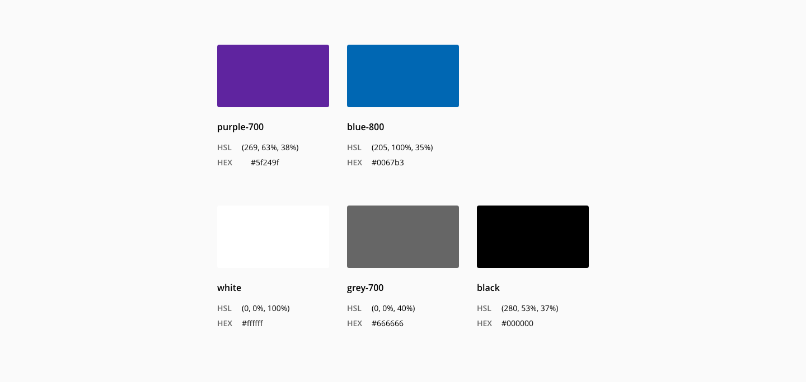
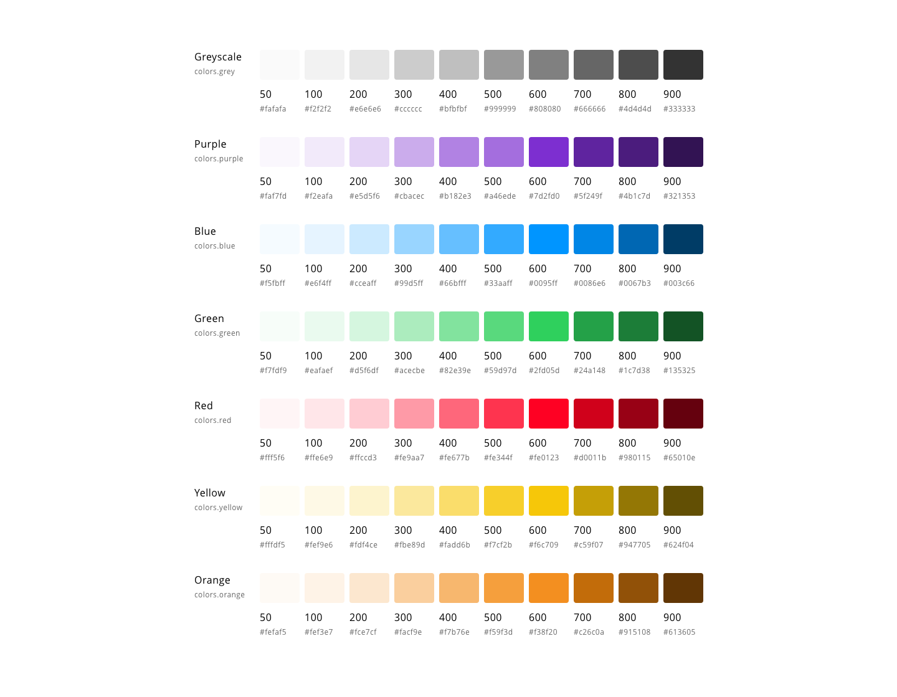

# Color

_Base Halstack core colors_

**The color palette is an essential asset as a communication resource of our design system.**

Halstack color palette brings a unified consistency and helps in guiding the user's perception order. Our color palette is based in the [HSL model](https://en.wikipedia.org/wiki/HSL_and_HSV#:~:text=The%20HSL%20representation%20models%20the,paint%20corresponds%20to%20a%20high%20%22) and the light (L) and dark (D) varianst are calculated changing the lightness value of the standard (S) DXC palette colors.

## Color Tokens

Halstack uses tokens to manage color. Appart from a multi-purpose greyscale family, purple and blue are the core color families used in our set of components. Additional families as red, green and yellow help as feedback role-based color palettes and must not be used outside this context.

### Core color tokens

_Core color families and lightness values_

#### Greyscale

| Name                | Value (hex)  | Value (hsl)      | 
| :---                | :---         | :---             |
| `grey-50`           | #fafafa      | (0, 0%, 98%)     |
| `grey-100`          | #f2f2f2      | (0, 0%, 95%)     |
| `grey-200`          | #e6e6e6      | (0, 0%, 90%)     |
| `grey-300`          | #cccccc      | (0, 0%, 80%)     |
| `grey-400`          | #bfbfbf      | (0, 0%, 75%)     |
| `grey-500`          | #999999      | (0, 0%, 60%)     |
| `grey-600`          | #808080      | (0, 0%, 60%)     |
| `grey-700`          | #666666      | (0, 0%, 40%)     |
| `grey-800`          | #4d4d4d      | (0, 0%, 30%)     |
| `grey-900`          | #333333      | (0, 0%, 20%)     |

#### Purple

The core Purple family serves as the primary action color.

| Name                | Value (hex)  | Value (hsl)      | 
| :---                | :---         | :---             |
| `purple-50`         | #faf7fd      | (269, 63%, 98%)  |
| `purple-100`        | #f2eafa      | (269, 63%, 95%)  |
| `purple-200`        | #e5d5f6      | (269, 63%, 90%)  |
| `purple-300`        | #cbacec      | (269, 63%, 80%)  |
| `purple-400`        | #b182e3      | (269, 63%, 70%)  |
| `purple-500`        | #a46ede      | (269, 63%, 65%)  |
| `purple-600`        | #7d2fd0      | (269, 63%, 50%)  |
| `purple-700`        | #5f249f      | (269, 63%, 38%)  |
| `purple-800`        | #4b1c7d      | (269, 63%, 30%)  |
| `purple-900`        | #321353      | (269, 63%, 20%)  |

#### Blue

The core Blue family serves as the accent color.

| Name                | Value (hex)  | Value (hsl)      |
| :---                | :---         | :---             |
| `blue-50`           | #f5fbff      | (205, 100%, 98%) |
| `blue-100`          | #e6f4ff      | (205, 100%, 95%) |
| `blue-200`          | #cceaff      | (205, 100%, 90%) |
| `blue-300`          | #99d5ff      | (205, 100%, 80%) |
| `blue-400`          | #66bfff      | (205, 100%, 70%) |
| `blue-500`          | #33aaff      | (205, 100%, 60%) |
| `blue-600`          | #0095ff      | (205, 100%, 50%) |
| `blue-700`          | #0086e6      | (205, 100%, 45%) |
| `blue-800`          | #0067b3      | (205, 100%, 35%) |
| `blue-900`          | #003c66      | (205, 100%, 20%) |

#### Red

| Name                | Value (hex)  | Value (hsl)      |
| :---                | :---         | :---             |
| `red-50`            | #fff5f6      | (352, 99%, 98%)  |
| `red-100`           | #ffe6e9      | (352, 99%, 95%)  |
| `red-200`           | #ffccd3      | (352, 99%, 90%)  |
| `red-300`           | #fe9aa7      | (352, 99%, 80%)  |
| `red-400`           | #fe677b      | (352, 99%, 70%)  |
| `red-500`           | #fe344f      | (352, 99%, 60%)  |
| `red-600`           | #fe0123      | (352, 99%, 50%)  |
| `red-700`           | #d0011b      | (352, 99%, 41%)  |
| `red-800`           | #980115      | (352, 99%, 30%)  |
| `red-900`           | #65010e      | (352, 99%, 20%)  |

#### Green

| Name                | Value (hex)  | Value (hsl)      |
| :---                | :---         | :---             |
| `green-50`          | #f7fdf9      | (137, 63%, 95%)  |
| `green-100`         | #eafaef      | (137, 63%, 95%)  |
| `green-200`         | #d5f6df      | (137, 63%, 90%)  |
| `green-300`         | #acecbe      | (137, 63%, 80%)  |
| `green-400`         | #82e39e      | (137, 63%, 70%)  |
| `green-500`         | #59d97d      | (137, 63%, 60%)  |
| `green-600`         | #2fd05d      | (137, 63%, 50%)  |
| `green-700`         | #24a148      | (137, 63%, 39%)  |
| `green-800`         | #1c7d38      | (137, 63%, 30%)  |
| `green-900`         | #135325      | (137, 63%, 20%)  |

#### Yellow

| Name                | Value (hex)  | Value (hsl)      |
| :---                | :---         | :---             |
| `yellow-50`         | #fffdf5      | (48, 93%, 98%)   |
| `yellow-100`        | #fef9e6      | (48, 93%, 95%)   |
| `yellow-200`        | #fdf4ce      | (48, 93%, 90%)   |
| `yellow-300`        | #fbe89d      | (48, 93%, 80%)   |
| `yellow-400`        | #fadd6b      | (48, 93%, 70%)   |
| `yellow-500`        | #f7cf2b      | (48, 93%, 57%)   |
| `yellow-600`        | #f6c709      | (48, 93%, 50%)   |
| `yellow-700`        | #c59f07      | (48, 93%, 40%)   |
| `yellow-800`        | #947705      | (48, 93%, 30%)   |
| `yellow-900`        | #624f04      | (48, 93%, 20%)   |

#### Orange

| Name                | Value (hex)  | Value (hsl)      |
| :---                | :---         | :---             |
| `orange-50`         | #fefaf5      | (32, 90%, 98%)   |
| `orange-100`        | #fef3e7      | (32, 90%, 95%)   |
| `orange-200`        | #fce7cf      | (32, 90%, 90%)   |
| `orange-300`        | #facf9e      | (32, 90%, 80%)   |
| `orange-400`        | #f7b76e      | (32, 90%, 70%)   |
| `orange-500`        | #f59f3d      | (32, 90%, 60%)   |
| `orange-600`        | #f38f20      | (32, 90%, 54%)   |
| `orange-700`        | #c26c0a      | (32, 90%, 40%)   |
| `orange-800`        | #915108      | (32, 90%, 30%)   |
| `orange-900`        | #613605      | (32, 90%, 20%)   |

### Color usage tokens

The color-usage tokens are a role-based and specify the core tokens that serve those roles in the UI. We use the core families mostly for enabled states, for other states (e.g. hover, pressed, disabled) or purpose every light or dark family variant is used. 

| Token                       | Description                                   | Name                | 
| :---                        | :---                                          | :---                |  
| `ui-background-01`          | _Default page background_                     | `Hal-White`         | 
| `ui-background-02`          | _Alternate page background_                   | `Hal-Grey-L-95`     | 
| `interactive-01`            | _Primary interactive color_                   | `Hal-Purple-S-38`   | 
| `interactive-02`            | _Secondary interactive color_                 | `Hal-Blue-S-30`     | 
| `danger-01`                 | _Danger button variant_                       | `Hal-Red-S-41`      | 
| `container-background-01`   | _Primary background color on containers_      | `Hal-Purple-S-38`   | 
| `container-background-02`   | _Background color on light containers_        | `Hal-White`         | 
| `container-background-03`   | _Background color on dark containers_         | `Hal-Black`         | 
| `text-01`                   | _Primary text_                                | `Hal-Black`         | 
| `text-02`                   | _Secondary text_                              | `Hal-Grey-S-40`     | 
| `text-03`                   | _Text on dark backgrounds_                    | `Hal-White`         | 
| `text-error`                | _Error messages_                              | `Hal-Red-S-41`      | 
| `link-01`                   | _Primary link color_                          | `H-Blue-L-50`       | 
| `link-02`                   | _Secondary link color_                        | `Hal-Blue-S-35`     | 
| `icon-01`                   | _Primary con color_                           | `Hal-Purple-S-38`   | 
| `icon-02`                   | _Icon color on light background_              | `Hal-Black`         | 
| `icon-03`                   | _Icon color on dark background_               | `Hal-White`         | 
| `feedback-error`            | _Error_                                       | `Hal-Red-S-41`      | 
| `feedback-success`          | _Success_                                     | `Hal-Green-S-39`    | 
| `feedback-warning`          | _Warning_                                     | `Hal-Yellow-S-57`   | 
| `feedback-info`             | _Info_                                        | `Hal-Blue-L-50`     | 
| `ui-overlay`                | _Background overlay_                          | `Hal-Black`         | 
| `ui-line`                   | _dividers; underline_                         | `Hal-Grey-L-75`     | 
| `focus-01`                  | _Primary focus underline/outline_             | `Hal-Purple-S-38`   | 
| `focus-02`                  | _Secondary focus underline/outline_           | `Hal-Blue-S-35`     | 
| `hover-01`                  | _Hover primary on light color_                | `Hal-Purple-L-95`   | 
| `hover-02`                  | _Hover primary on dark color_                 | `Hal-Purple-D-30`   | 
| `hover-03`                  | _Tertiary hover color_                        | `Hal-Black`         | 
| `hover-background`          | _Background hover color on light containers_  | `Hal-Grey-L-95`     | 
| `hover-background-selected` | _hover on selected background color_          | `Hal-Grey-L-60`     | 
| `hover-danger`              | _Danger hover color_                          | `Hal-Red-D-30`      | 
| `pressed-01`                | _Pressed primary on light color_              | `Hal-Purple-L-95`   | 
| `pressed-02`                | _Pressed primary on dark color_               | `Hal-Purple-D-20`   | 
| `pressed-03`                | _Pressed secondary color_                     | `Hal-Blue-D-20`     | 
| `pressed-danger`            | _Danger pressed color_                        | `Hal-Red-D-20`      | 
| `selected-background`       | _Background selected color_                   | `Hal-Grey-L-75`     | 
| `disabled-01`               | _Background disabled color_                   | `Hal-Grey-L-95`     | 
| `disabled-02`               | _Text disabeld color_                         | `Hal-Grey-L-75`     | 
| `link-visited`              | _Visited link color_                          | `Hal-Purple-S-38`   | 

## Data visualization colors

> To do section

## Accesibility

> To do section

____________________________________________________________

[Edit this page on Github](https://github.com/dxc-technology/halstack-style-guide/blob/master/guidelines/principles/colors/README.md)

