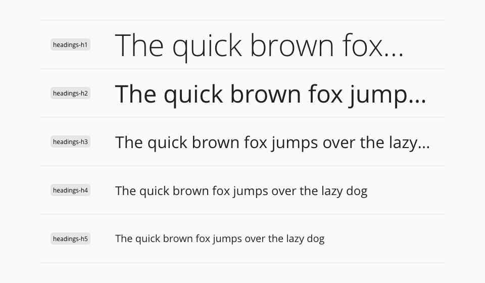
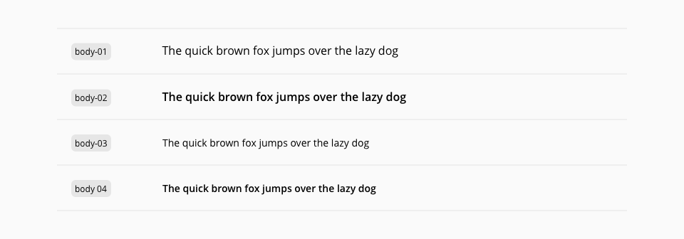

# Typography

## Typography hierarchy
Our selected typography helps in structuring our user's experience based on the visual impact that it has on the user interface content. 
It defines what is the first noticeable piece of information or data based on the font shape, size, color, 
or type and it highlights some pieces of text over the rest. Some typographic elements used in Halstack Design System include headers, 
body, taglines, captions, and labels.

Make sure you include all the different typographic variants in order to enhance the application's content structure, including the Heading component which defines different levels of page and section titles

## Font family

For our sans-serif `font-family`, we use the humanist typeface Open Sans, designed by Steve Matteson and licensed under the [Apache License, Version 2.0.](https://www.apache.org/licenses/LICENSE-2.0.html)

| Token                         | Description                                   | Property            | Value                          | 
| :---                          | :---                                          | :---                | :---                           |  
| `font-family-sans`            | _Default font family sans-serif_              | `font-family`       | 'Open Sans', sans-serif        | 
| `font-family-mono`            | _Default font family monospaced_              | `font-family`       |  Source Code Pro', monospace   | 

## Weight

In order to add contrast between typographic elements in the UI, Halstack uses four different and well balanced `font-weight` values.

| Token                         | Description                                   | Property            | Value        | 
| :---                          | :---                                          | :---                | :---         |  
| `font-weight-light`           | _Set font weight as light (300)_              | `font-weight`       | 300          | 
| `font-weight-regular`         | _Set font weight as regular (400)_            | `font-weight`       | 400          | 
| `font-weight-semibold`        | _Set font weight as semibold (600)_           | `font-weight`       | 600          | 
| `font-weight-bold`            | _Set font weight as bold (700)_               | `font-weight`       | 700          | 

## Scale

As we approached the foundational elements with simplification and standardization in mind, the typographic scale is one of the most important elements to create hierarchy. Our type scale provides eight relative values based on a root font size of 16px, making it scalable and accesible. 

| Token                         | Description                                   | Property            | Value(rem)   | 
| :---                          | :---                                          | :---                | :---         |  
| `font-scale-01`               | _Set the font size as 12px_                   | `font-size`         | 0.75         |       
| `font-scale-02`               | _Set the font size as 14px_                   | `font-size`         | 0.875        | 
| `font-scale-03`               | _Set the font size as 16px_                   | `font-size`         | 1            | 
| `font-scale-04`               | _Set the font size as 20px_                   | `font-size`         | 1.25         | 
| `font-scale-05`               | _Set the font size as 24px_                   | `font-size`         | 1.5          | 
| `font-scale-06`               | _Set the font size as 32px_                   | `font-size`         | 2            | 
| `font-scale-07`               | _Set the font size as 48px_                   | `font-size`         | 3            | 
| `font-scale-08`               | _Set the font size as 60px_                   | `font-size`         | 3.75         | 

## Formatting

### Style

| Token                         | Description                                   | Property            | Value        | 
| :---                          | :---                                          | :---                | :---         |  
| `font-style-italic`           | _Set font style as italic_                    | `font-style`        | italic       | 
| `font-style-normal`           | _Set font style as normal_                    | `font-style`        | normal       | 

### Letter spacing

We calibrate our `letter-spacing` at large scales to provide a better legibility and readability of our text.

| Token                         | Description                                   | Property            | Value(em)    | 
| :---                          | :---                                          | :---                | :---         | 
| `font-tracking-tight-02`      | _Set letter spacing as -0.025em_              | `letter-spacing`    | -0.025       |
| `font-tracking-tight-01`      | _Set letter spacing as -0.0125em_             | `letter-spacing`    | -0.0125      |
| `font-tracking-normal`        | _Set letter spacing as 0em_                   | `letter-spacing`    | 0            | 
| `font-tracking-wide-01`       | _Set letter spacing as 0.025em_               | `letter-spacing`    | 0.025        |
| `font-tracking-wide-02`       | _Set letter spacing as 0.05em_                | `letter-spacing`    | 0.05         |
| `font-tracking-wide-03`       | _Set letter spacing as 0.1em_                 | `letter-spacing`    | 0.1          | 

### Leading

We use a ratio of 1:1.5 as a standard `line-height` value. A body font of 16px (1rem) returns a value of 24px (1.5rem), which is the main reference measurement for the vertical organization.

| Token                          | Description                                   | Property            | Value(em)    | 
| :---                           | :---                                          | :---                | :---         | 
| `font-leading-compact-03`      | _Set line height as 1em_                      | `line-height`       | 1            | 
| `font-leading-compact-02`      | _Set line height as 1.25em_                   | `line-height`       | 1.25         |
| `font-leading-compact-01`      | _Set line height as 1.365em_                  | `line-height`       | 1.365        |
| `font-leading-normal`          | _Set line height as 1.5em_                    | `line-height`       | 1.5          |
| `font-leading-loose-01`        | _Set line height as 1.715em_                  | `line-height`       | 1.715        |
| `font-leading-loose-02`        | _Set line height as 2em_                      | `line-height`       | 2            |
 

### Capitalization

| Token                          | Description                                   | Property            | Value        | 
| :---                           | :---                                          | :---                | :---         |  
| `font-transform-initial`       | _Preserve default value_                      | `text-transform`    | initial      | 
| `font-transform-lowercase`     | _Transform text to lowercase_                 | `text-transform`    | lowercase    |
| `font-transform-uppercase`     | _Transform text to uppercase_                 | `text-transform`    | uppercase    |

### Text decoration

| Token                          | Description                                   | Property            | Value        | 
| :---                           | :---                                          | :---                | :---         | 
| `font-decoration-no-line`      | _Unset all present decorations_               | `text-decoration`   | none         | 
| `font-decoration-underline`    | _Underline the text_                          | `text-decoration`   | underline    | 
| `font-decoration-line-through` | _Put a strikethrough the text_                | `text-decoration`   | line-through |

## Hasltack type set

### Headings

_Heading set styles_

Styles for the headings can be found in the [component documentation](https://developer.dxc.com/design/guidelines/components/heading). When using native `<h1>...<h5>` html tags or a different component to represent application headings, use the styles defined.

### Body

_Body set styles_

#### body-01

| Property              | Core token                   | Value                    | 
| :-------------------- | :--------------------------- | :----------------------- | 
| `font-family`         | `font-family-sans`           | 'Open Sans', sans-serif  |
| `font-weight`         | `font-weight-regular`        | 400                      |
| `font-size`           | `font-scale-03`              | 1rem / 16px              |
| `font-style`          | `font-style-normal`          | normal                   |
| `text-transform`      | `font-transform-initial`     | initial                  |
| `letter-spacing`      | `font-tracking-normal`       | 0                        |
| `line-height`         | `font-leading-normal`        | 1.5em                    |

#### body-02

| Property              | Core token                   | Value                    | 
| :-------------------- | :--------------------------- | :----------------------- | 
| `font-family`         | `font-family-sans`           | 'Open Sans', sans-serif  |
| `font-weight`         | `font-weight-semibold`       | 600                      |
| `font-size`           | `font-scale-03`              | 1rem / 16px              |
| `font-style`          | `font-style-normal`          | normal                   |
| `text-transform`      | `font-transform-initial`     | initial                  |
| `letter-spacing`      | `font-tracking-normal`       | 0                        |
| `line-height`         | `font-leading-normal`        | 1.5em                    |

#### body-03

| Property              | Core token                   | Value                    | 
| :-------------------- | :--------------------------- | :----------------------- | 
| `font-family`         | `font-family-sans`           | 'Open Sans', sans-serif  |
| `font-weight`         | `font-weight-regular`        | 400                      |
| `font-size`           | `font-scale-02`              | 0.875rem / 14px          |
| `font-style`          | `font-style-normal`          | normal                   |
| `text-transform`      | `font-transform-initial`     | initial                  |
| `letter-spacing`      | `font-tracking-normal`       | 0                        |
| `line-height`         | `font-leading-normal`        | 1.5em                    |

#### body-04

| Property              | Core token                   | Value                    | 
| :-------------------- | :--------------------------- | :----------------------- | 
| `font-family`         | `font-family-sans`           | 'Open Sans', sans-serif  |
| `font-weight`         | `font-weight-semibold`       | 600                      |
| `font-size`           | `font-scale-02`              | 0.875rem / 14px          |
| `font-style`          | `font-style-normal`          | normal                   |
| `text-transform`      | `font-transform-initial`     | initial                  |
| `letter-spacing`      | `font-tracking-normal`       | 0                        |
| `line-height`         | `font-leading-normal`        | 1.5em                    |

### Additional styles

_Additional caption and overline styles_

#### caption

| Property              | Core token                   | Value                    | 
| :-------------------- | :--------------------------- | :----------------------- | 
| `font-family`         | `font-family-sans`           | 'Open Sans', sans-serif  |
| `font-weight`         | `font-weight-regular`        | 400                      |
| `font-size`           | `font-scale-01`              | 0.75rem / 12px           |
| `font-style`          | `font-style-italic`          | italic                   |
| `text-transform`      | `font-transform-initial`     | initial                  |
| `letter-spacing`      | `font-tracking-normal`       | 0                        |
| `line-height`         | `font-leading-normal`        | 1.5em                    |

#### overline

| Property              | Core token                   | Value                    | 
| :-------------------- | :--------------------------- | :----------------------- | 
| `font-family`         | `font-family-sans`           | 'Open Sans', sans-serif  |
| `font-weight`         | `font-weight-regular`        | 400                      |
| `font-size`           | `font-scale-02`              | 0.875rem / 14px          |
| `font-style`          | `font-style-italic`          | italic                   |
| `text-transform`      | `font-transform-uppercase`   | uppercase                |
| `letter-spacing`      | `font-tracking-wide-02`      | 0.05em                   |
| `line-height`         | `font-leading-normal`        | 1.5em                    |

____________________________________________________________

[Edit this page on Github](https://github.com/dxc-technology/halstack-style-guide/blob/master/guidelines/principles/typography/README.md)
